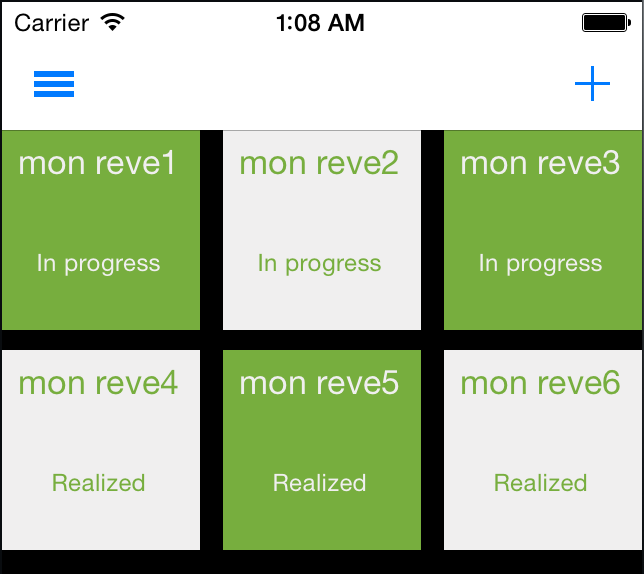
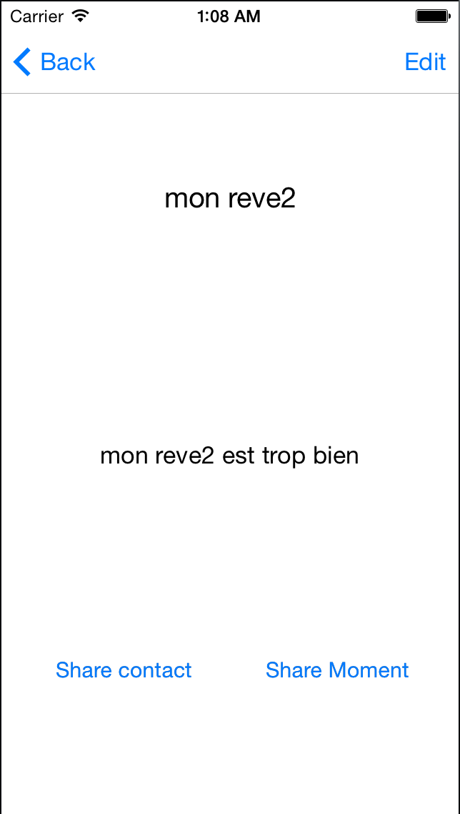

[While 42 hackaton](http://while42.org)
=======

### Our Idea
WeDream : an app to share our dreams.

### How to use

1. Open the app and start adding some dreams
2. Click on a dream tile and share it to a contact or in your WeChat timeline
3. Enjoy :)

### Todo

* Possibility to change the status of the dream (realized, in progress)
* Possibility to a custom color for a dream's tile

### Release history

All releases are here : https://github.com/CostardRouge/WeDream/releases

### Author
* Steeve POMMIER [Github](https://github.com/CostardRouge) / [Twitter](https://twitter.com/LeBlousonRouge)
* Flavien DI-BELLO [Github](https://github.com/lwinged)
* Tracy NELCHA [Twitter](https://twitter.com/GlwadysN)